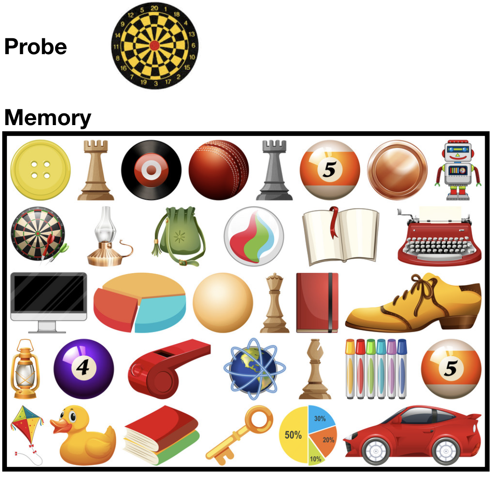

```{r setup, include = FALSE}
library("papaja") # loads the papaja library
# this chunk could be used to load other R packages used throughout this document
```

```{r analysis-preferences}
# Seed for random number generation
set.seed(42)
knitr::opts_chunk$set(cache.extra = knitr::rand_seed) # this line sets global knitr chunk options.
```

This text is for the body of the introduction. This is how you **bold** text. This is *italics*. Lorem ipsum dolor sit amet, consectetur adipiscing elit. Integer fringilla orci odio, eget venenatis diam aliquet nec. [^f1] Vivamus sodales aliquam tortor ac scelerisque. Nullam laoreet est id dolor rhoncus bibendum. Etiam eleifend, tortor vel euismod ullamcorper, nunc enim lacinia eros, at semper nulla arcu eget est. Pellentesque dapibus euismod sem, sed sollicitudin nisi blandit ac. Quisque dapibus lorem id felis cursus, id placerat magna dapibus. Sed id nibh dictum, tristique nulla non, tempor ipsum. [^thing2]

[^f1]: This is a footnote.
[^thing2]: This is another footnote.

<!-- These are comments that are not printed to the manuscript -->

# First level header

In sit amet arcu congue, elementum tellus nec, pellentesque libero. Nulla facilisi. Aenean ornare nisi eget lacus pulvinar, eget imperdiet massa dignissim. Aliquam scelerisque ut libero sed condimentum. Sed ut consectetur justo. 

## Second level header

Quisque dapibus sem non fringilla volutpat. Sed finibus magna et eros pharetra posuere. Nunc id elit metus. Mauris quis malesuada massa. Fusce et auctor felis. Aenean id sem ex. Nulla viverra leo in quam cursus auctor. Nullam rutrum erat quis lobortis ullamcorper.

### Third level header

Quisque dapibus sem non fringilla volutpat. Sed finibus magna et eros pharetra posuere. Nunc id elit metus. Mauris quis malesuada massa. Fusce et auctor felis. Aenean id sem ex. Nulla viverra leo in quam cursus auctor. Nullam rutrum erat quis lobortis ullamcorper.

# Citations

Citations are similar to Latex. Place bibliographic entries in a .bib file, then link to the .bib file in the YAML above. This example uses `example.bib`. Use a reference manager like Zotero to export bib files for collections of manuscripts, or write them by hand, or copy and paste from google scholar.

An example of citing a paper with author year in parentheses [@crumpContextualControlTaskset2010]. Separate citation keys with semicolons to add multiple citations [@crumpContextualControlTaskset2010;@jamiesonMemorybasedAccountRetrospective2010]. 

To cite the author alone with year in parentheses use @crumpContextualControlTaskset2010. To cite year only, use [-@crumpContextualControlTaskset2010].

To add a prefix to the citation [see also, @crumpContextualControlTaskset2010]. To add a postfix [see also, @crumpContextualControlTaskset2010, for a review]

# Equations

Use Latex syntax for math equations by placing formulas between dollar signs. 

$a^2 + b^2 = c^2$

You should see a preview of the equation in RStudio if you hover over the equation.

Include equations inside Latex style syntax for cross-referencing. Note, this also illustrates that latex syntax can be written directly, and will be treated as Latex for compiling the output.

\begin{equation}
a_i = (\frac{\sum_{j=1}^{j=n}p_j \times M_{ij}}{\sqrt{\sum_{j=1}^{j=n}p_j^2}\sqrt{\sum_{j=1}^{j=n}M_{ij}^2}})^{tau}
(\#eq:activation)
\end{equation}

Cross reference the equation like this, see Equation\ \@ref(eq:activation).

# External images

Using `knitr::include_graphics()` is a versatile method for inserting external images. The file path is relative to the folder containing the .Rmd file for the manuscript. In this case, the `logo.png` file is in the same folder as `manuscript.Rmd`, so we simply locate the file directly.

```{r vertical, fig.cap="An example external image.", out.width="50%"}

```

The name for the codechunk above is `vertical`, which can later be used as a cross-reference to figure, see Figure \@ref(fig:vertical).


# Experiment 1

## Methods
We report how we determined our sample size, all data exclusions (if any), all manipulations, and all measures in the study. <!-- 21-word solution (Simmons, Nelson & Simonsohn, 2012; retrieved from http://ssrn.com/abstract=2160588) -->

### Participants

### Material

### Procedure

### Data analysis
We used `r cite_r("r-references.bib")` for all our analyses.

## Results

Content stored in R variables can be injected into the document. However, the R variables must be defined before they can be inserted. For example, the following code chunk assigns a values of 1 to a variable x.

```{r}
x <- 1
```

Now, the content of this variable can be reported using an inline r code chunk as follows, the value of x is `r x`.

```{r}
library(verticaltutorial)
library(dplyr)
library(kableExtra)
library(tidyr)
library(ggplot2)

overall_means <- stroop_df %>%
                  group_by(posture,congruency) %>%
                  summarise(mean_rt = round(mean(rts), digits=0),
                            sem_rt = round((sd(rts)/sqrt(length(rts))), digits=0))

```


```{r meanstable, warning=FALSE, message=FALSE}
# Make and print the table

# format from long to wide
wide_means <- overall_means %>% 
  gather(variable, value, -(posture:congruency)) %>%
  unite(temp, congruency, variable) %>%
  spread(temp, value)

# rename columns
names(wide_means)[2:5] <- c("RT","SEM","RT","SEM")

# print table
kable(wide_means, "latex", caption = "Mean Reaction Times and Standard Errors of the Mean for Experiment 3", booktabs = T) %>%
  kable_styling() %>%
  add_header_above(c(" " = 1, "Congruent" = 2, "Incongruent" = 2))
```

```{r stroopfig, fig.cap="Mean reaction times wth standard error bars as a function of Posture and Congruency for Experiment 3"}
# make and print the figure
ggplot(overall_means, aes(x=posture,
                          y=mean_rt, 
                          group=congruency,
                          fill=congruency))+
  geom_bar(stat="identity",position="dodge")+
  theme_classic(base_size=12)+
  ylab("Mean Reaction Time (ms)")+
  geom_errorbar(aes(ymin=mean_rt - sem_rt,
                    ymax=mean_rt + sem_rt),
                position=position_dodge(width=0.9),
                width=.2,
                color="black")+
  coord_cartesian(ylim=c(750,1000))
```

```{r aovtable, results="asis"}
## ANOVA
aov_out <- aov(rts~posture*congruency + Error(subject/(posture*congruency)), stroop_df)
apa_aov <- apa_print(summary(aov_out))
apa_table(
  apa_aov$table
  , caption = "ANOVA table for Experiment 3"
)
```

Below are examples of writing the results using two methods. The first method is to report all of the values by hand. The second method is to embed the results of R variables into the reporting using papaja. Both results sections appear similar in the .pdf, so look at the .rmd file for this example to see how to use papaja.

## By hand reporting

Mean reaction times for each subject in each condition to a 2 (Congruency: congruent vs. incongruent) x 2 (Posture: Standing vs. Sitting) were submitted to a repeated measures ANOVA. Mean RTs in each condition are displayed in Table \@ref(tab:meanstable), and in Figure \@ref(fig:stroopfig). The full ANOVA table is reported in Table \@ref(tab:aovtable).

There was a main effect of Congruency, F (1, 49) = 342.45, MSE = 1684.39, p < 0.001. Mean reaction times were slower for incongruent (922 ms) than congruent groups (815 ms).

There main effect of Posture was significant, F (1, 49) = 7.33, MSE = 4407.09, p =.009. Mean reaction times were slower for sitting (881 ms) than standing groups (855 ms).

The two-way interaction between Congruency and Posture was significant, F (1, 49) = 8.96, MSE = 731.82, p < 0.004. The Stroop effect was 23 ms smaller in the standing than sitting conditions.

## papaja reporting

There was a main effect of Congruency, `r apa_aov$full_result$congruency`. Mean reaction times were slower for incongruent (922 ms) than congruent groups (815 ms).

There main effect of Posture was significant, `r apa_aov$full_result$posture`. Mean reaction times were slower for sitting (881 ms) than standing groups (855 ms).

The two-way interaction between Congruency and Posture was significant, `r apa_aov$full_result$posture_congruency`. The Stroop effect was 23 ms smaller in the standing than sitting conditions.

Note, I used the `apa_print()` function to automate reporting of the ANOVA statistics, however in this example I did not automate reporting of the means. This would be possible by separately computing the means of interest, and then reporting them using inline r chunks.

## Discussion

# General Discussion


\newpage

# References
```{r create_r-references}
r_refs(file = "r-references.bib")
```

\begingroup
\setlength{\parindent}{-0.5in}
\setlength{\leftskip}{0.5in}

<div id = "refs"></div>
\endgroup
