```{r setup, include=FALSE}
knitr::opts_chunk$set(echo = FALSE, warning=FALSE, message=FALSE, fig.align = "center", cache = FALSE, out.width = "100%")
library(nomnoml)
```

## Overview

1. What is git and github?
2. Getting started with Github
3. General tips

## Git

- *git* is version control software
- version control software keeps a historical record of changes to files in a git repository
- can go "back in time" to previous versions
- commonly used in collaborative software development to manage and review the integration of code from collaborators

## Github

- a website for hosting git repositories online
- free!
- can create public or private repositories
- easy method to share project assets, and integrates with open science framework (OSF)
- loads of additional features for project management

## Get your free github account

Sign up at <https://www.github.com>

```{r, out.width="80%"}

```

## Download Github Desktop

Download the version for your operating system <https://desktop.github.com>

```{r, out.width="80%"}
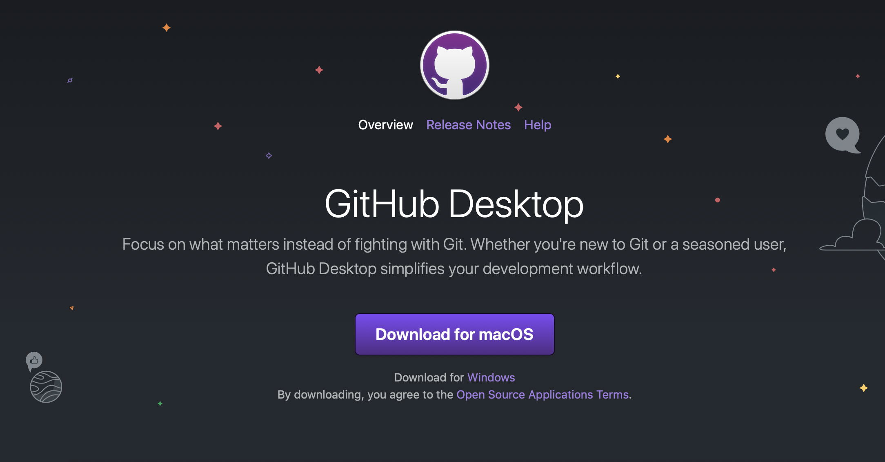
```

## Connect Github Desktop to your Github Account

Open Github Desktop, open the Preferences menu, then sign in with your Github Account.

```{r, out.width="80%"}
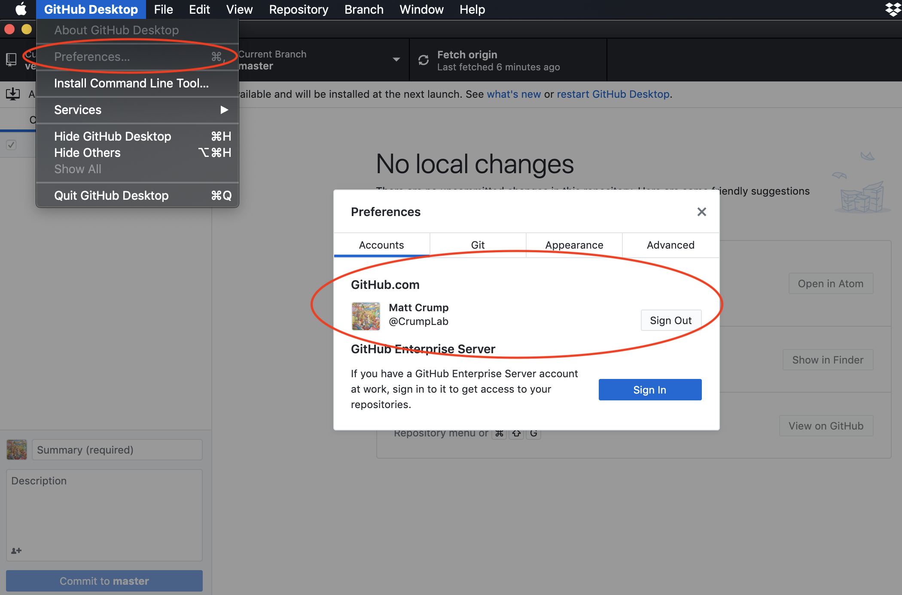
```

## Keeping (g)it simple

- Git and github are comprehensive tools for version control, and can become rather complicated.
- We will keep things simple and use **point and click** tools from Github Desktop (and the Github website)
- Alternatively, git and github can be controlled from the command line (e.g., unix terminal, not covered in this tutorial)
- Next, a quick conceptual overview

## Normal folders and git folders

Git folders look like normal folders, but have hidden .git files

<div class = "row">
<div class = "col-md-9">

```{nomnoml}

[<frame> Normal Folder |
   [Your Computer |
      [Folder |  File 1 | File 2 | etc. ]
      [Folder] -/- [Properties]
      [Properties | Not shared | Local | No version control]
      ]
   ]

[<frame> Git Folder |
   [Your Computer |
      [Git Folder |  File 1 | File 2 | Hidden .git files ]
      [Git Folder] -/- [Properties]
      [Properties | Not shared | Local | Has version control | Looks like a normal folder]
      ]
   ]

```

</div>
<div class = "col-md-3">


</div>
</div>

## git folders

<div class = "row">
<div class = "col-md-9">
```{nomnoml}
[<frame> Git Folder |
   [Your Computer |
      [Git Folder |  File 1 | File 2 | Hidden .git files ]
      [Git Folder] -> [Previous Versions]
      [Previous Versions |
          [Git Folder v.3 |  File 1 | File 2 | Hidden .git files ]
          [Git Folder v.2 |  File 1 | File 2 | Hidden .git files ]
          [Git Folder v.1 |  File 1 | File 2 | Hidden .git files ]
          [Git Folder v.3] -/- [Git Folder v.2]
          [Git Folder v.2] -/- [Git Folder v.1]
          ]
      ]
   ]

```

</div>
<div class = "col-md-3">
Git Folders store history of changes (version control)

</div>
</div>


## git master and branches

<div class = "row">
<div class = "col-md-9">
```{nomnoml}
[<frame> Git Folder |
   [Your Computer |
      [Git Folder |  File 1 | File 2 | Hidden .git files ]
      [Git Folder] -> [Master (Previous Versions)]
      [Git Folder] -> [Branch (Previous Versions)]
      [Master (Previous Versions) |
          [Git Folder v.3 |  File 1 | File 2 | Hidden .git files ]
          [Git Folder v.2 |  File 1 | File 2 | Hidden .git files ]
          [Git Folder v.1 |  File 1 | File 2 | Hidden .git files ]
          [Git Folder v.3] -/- [Git Folder v.2]
          [Git Folder v.2] -/- [Git Folder v.1]
          ]
       [Branch (Previous Versions) |
          [Git Folder v.3 |  File 1 | File 2 | Hidden .git files ]
          [Git Folder v.2 |  File 1 | File 2 | Hidden .git files ]
          [Git Folder v.1 |  File 1 | File 2 | Hidden .git files ]
          [Git Folder v.3] -/- [Git Folder v.2]
          [Git Folder v.2] -/- [Git Folder v.1]
          ]
      ]
   ]

```

</div>
<div class = "col-md-3">
Can have multiple branches

usually for development purposes

</div>
</div>

## git basics

<div class = "row">
<div class = "col-md-9">
```{nomnoml}
[<frame> Git Folder |
   [Your Computer |
      [Git Folder v.1 |  File 1 | File 2 | Hidden .git files ]
      [Git Folder v.1] --> [<usecase> Make Changes]
      [<usecase> Make Changes] -> [Commit Changes | add descriptive note | records change in version history]
      [<usecase> update to v.2] <- [Commit Changes]
      [Git Folder v.1] <- [<usecase> update to v.2]
      [Commit Changes] -> [<usecase> Save version]
      [<usecase> Save version]->[Version history |
                                   [Previous Versions|
                                      [v.1] -/- [v.0]]]
   ]
 ]

```

</div>
<div class = "col-md-3">
- Make changes to files
- "Commit" the changes
- git updates current version
- and saves the previous version

</div>
</div>


## git + github

<div class = "row">
<div class = "col-md-9">
```{nomnoml}

[<frame> git + Github |
  [Github.com Repository|
       [Git Folder v.1 |
          your files] -/- [Version history |
                                     [Previous Versions|
                                        [v.1] -/- [v.0]]]
       ]
   [Your Computer] -> [Push| Send to Github]
   [Your Computer|
       [Git Folder v.1 | your files]]
   [Push] -> [Github.com Repository]
   [Pull] <- [Github.com Repository]
   [Pull | Sync from Github | to local]
   [Your Computer] <- [Pull]
   [Github.com Repository]-/-[Github Features]
   [Github Features|share folder online|download as .zip|collaboration tools|website tools|share R packages|OSF integration]
]

```

</div>
<div class = "col-md-3">
- copy from local to Github.com
- "push" **to** Github.com
- "pull/sync" **from** Github.com
</div>
</div>

## Looks complicated, but...

<div class = "row">
<div class = "col-md-6">
```{r}

```

</div>
<div class = "col-md-6">

Complicated at first but...

- Relatively easy with Github Desktop
- Similar to Dropbox, but with commit notes
- let's get to some examples...
</div>
</div>

## Create a new git folder from RStudio

```{r, out.width="70%"}
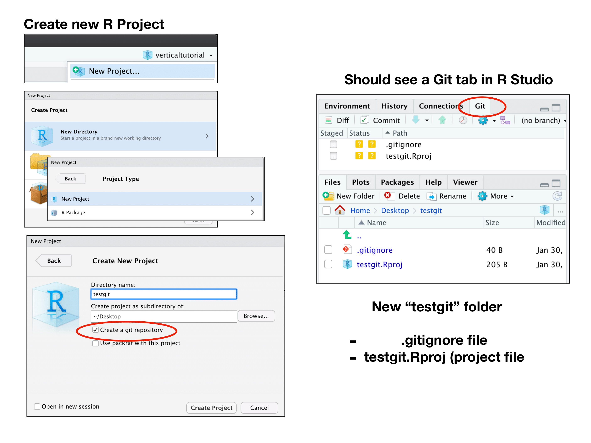
```

## Add new repo to Githup Desktop

```{r, out.width="70%"}
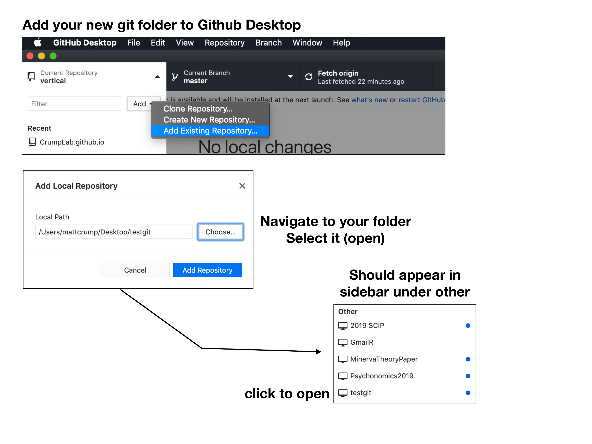
```

## Github Desktop (view and manage your repos)

```{r, out.width="70%"}
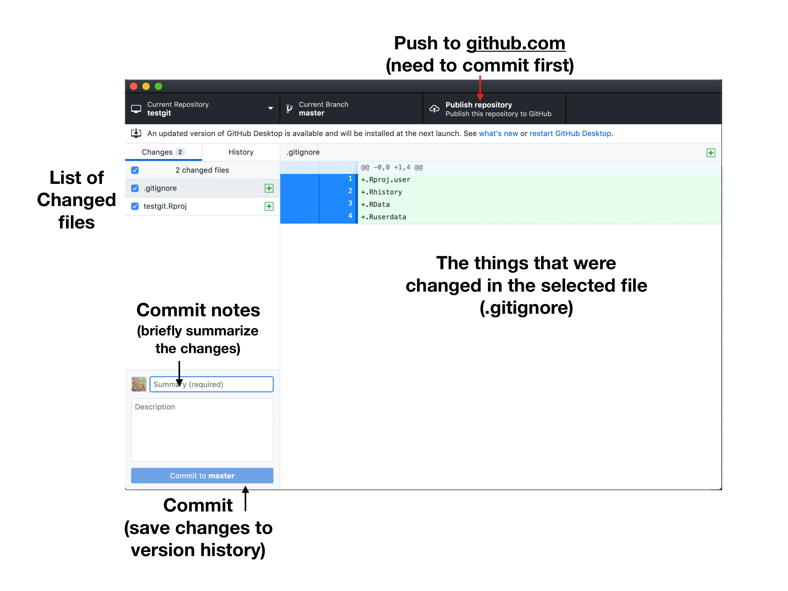
```

## Commit then publish

```{r, out.width="70%"}
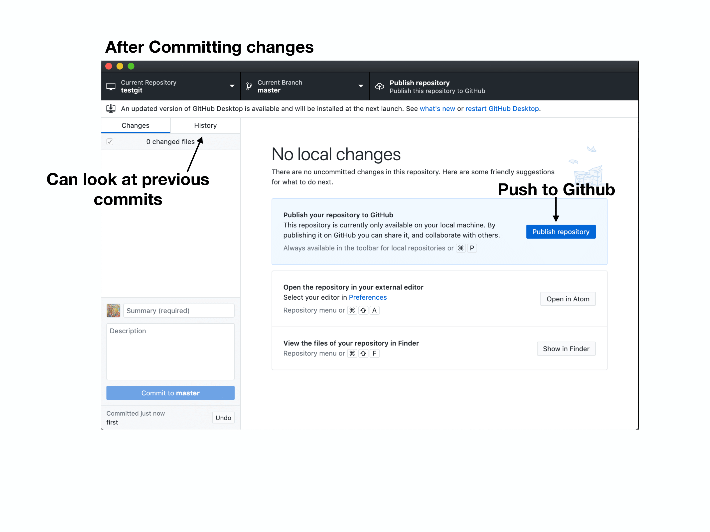
```

## Publishing to Github.com

```{r, out.width="70%"}
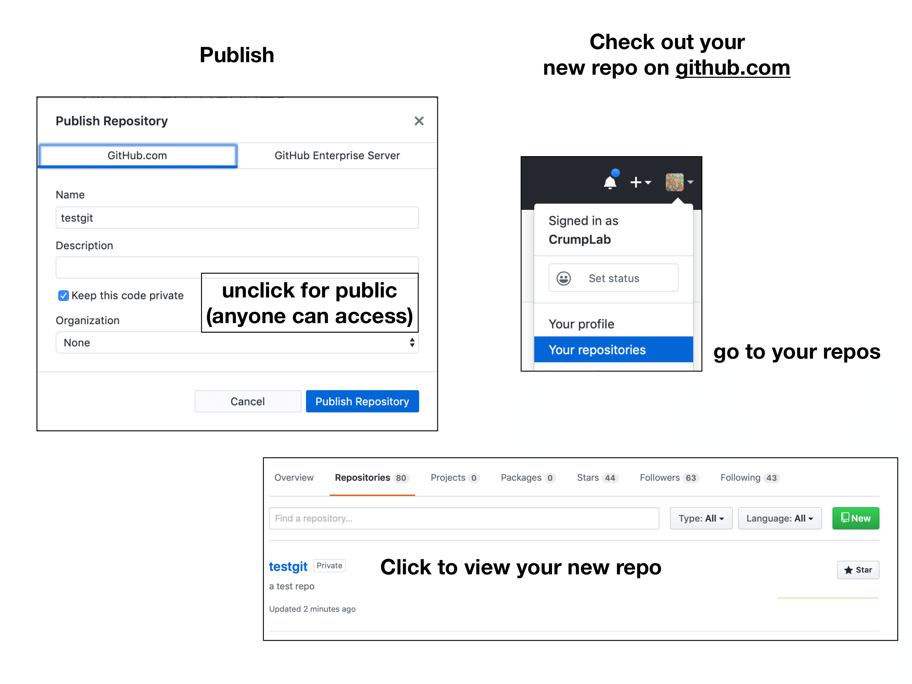
```

## Viewing your repo on Github.com

```{r, out.width="70%"}
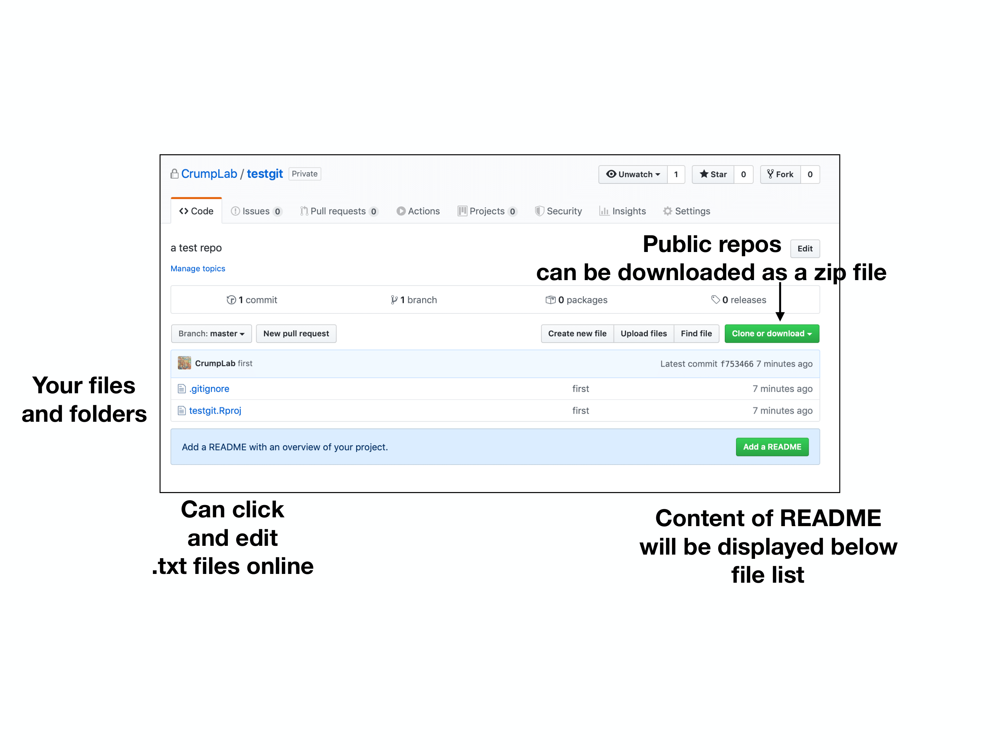
```

## Work on your files

```{r, out.width="70%"}
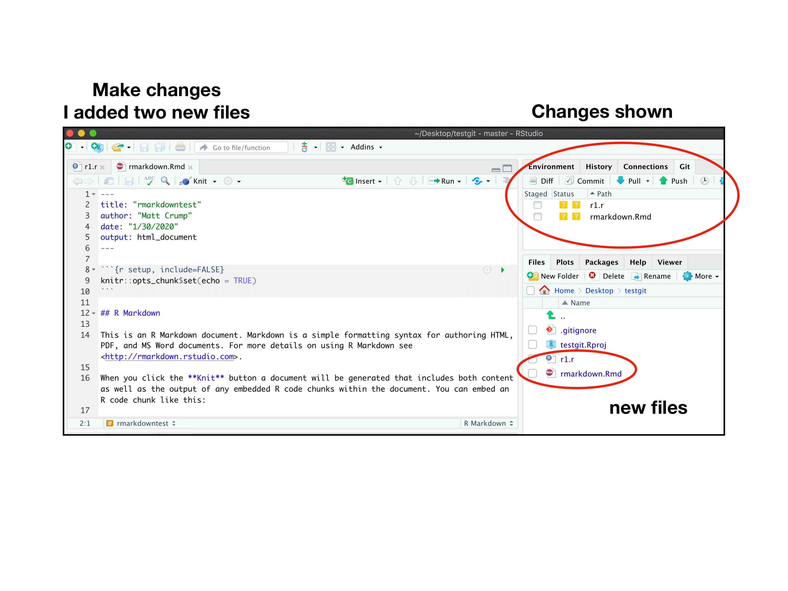
```

## Commit new changes in Github Desktop

```{r, out.width="70%"}
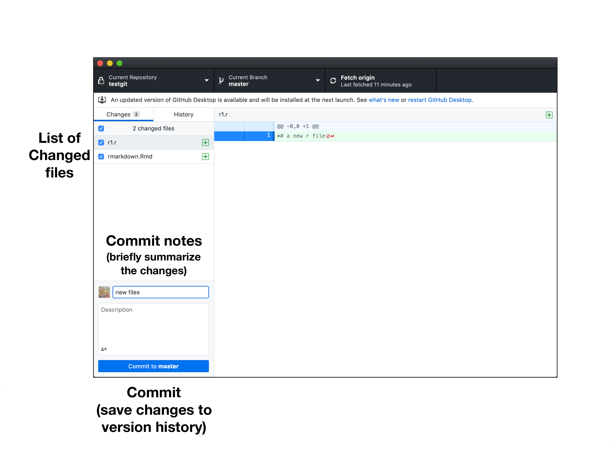
```

## Publish them to Github (if you want to)

```{r, out.width="70%"}
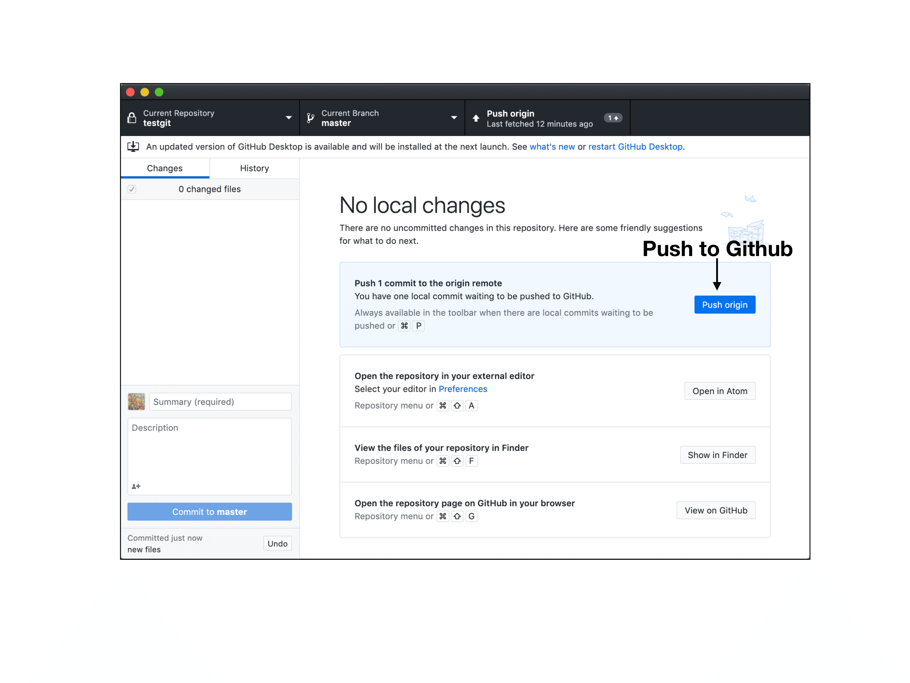
```

## Changes appear on Github.com

```{r, out.width="70%"}
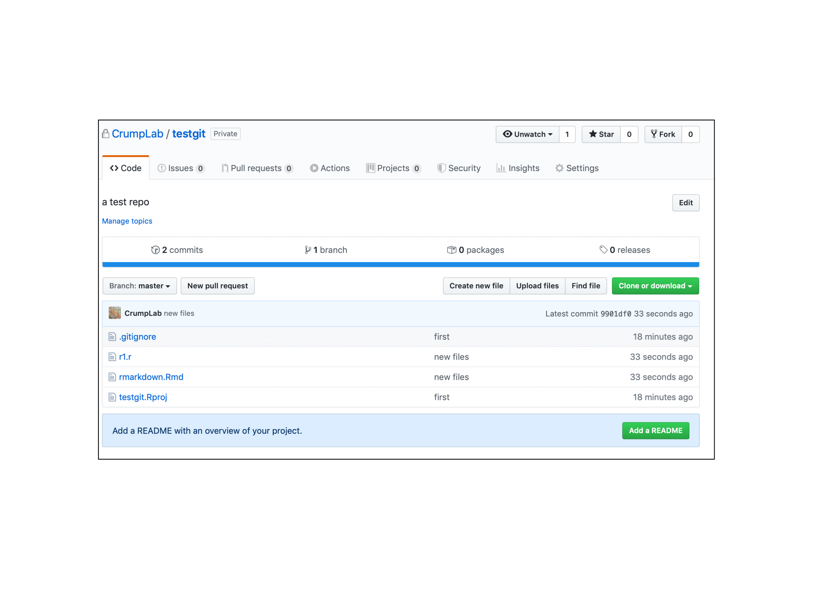
```

## That's Github in a nutshell

<div class = "row">
<div class = "col-md-6">
```{r}

```

</div>
<div class = "col-md-6">

Before moving on the next module...

A few more tips

</div>
</div>

## Making new local repos

- "Create new repository" from Github Desktop
- Creates a new git-ready folder
- It is only local to your computer, unless you choose to publish it
- It will be added to list of repositories in Github Desktop

## Cloning and Forking

From Github.com, if you have a Github account

### Cloning

- You can "clone" anyone else's public repository on Github.com
- This is like downloading as a .zip, but the repo will be downloaded and appear in Github Desktop on your local file system

### Forking

- press the fork button on Github.com
- copies the repo to your Github.com account (in the cloud)
- **forked** copies are connected to the original repo
- If you make changes, you can make "pull" requests to have your changes merged with the original repo

## Github Issues

Normally used to report and address "bugs" in software, but can be used as useful way to have discussions (with collaborators or yourself) about project-related tasks:

- Can "open" specific issues
 - creates a discussion thread for the issu
- Can "close" issues
 - once the issue has been addressed
- All threaded discussions are preserved, useful as a record of project development
- We used issues extensively in developing **vertical**
 - <https://github.com/CrumpLab/vertical/issues>
 
## Github Pages + OSF integration

We'll talk about Github Pages and OSF (open science framework) integration in later modules. Short story is that:

- Github repositories can serve websites
- Github respositories can easily be transferred (piped into) OSF repos, where you can mint a DOI and share your research assets.


