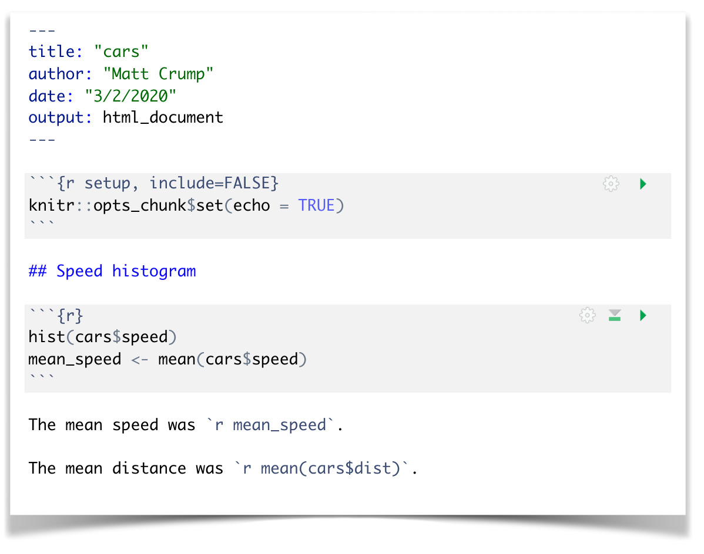
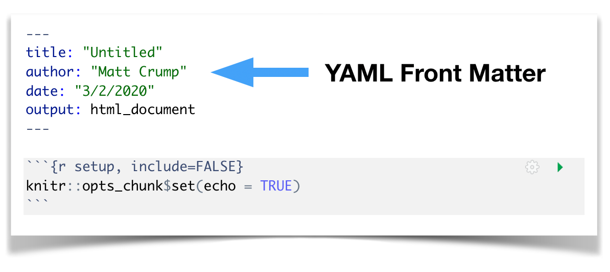
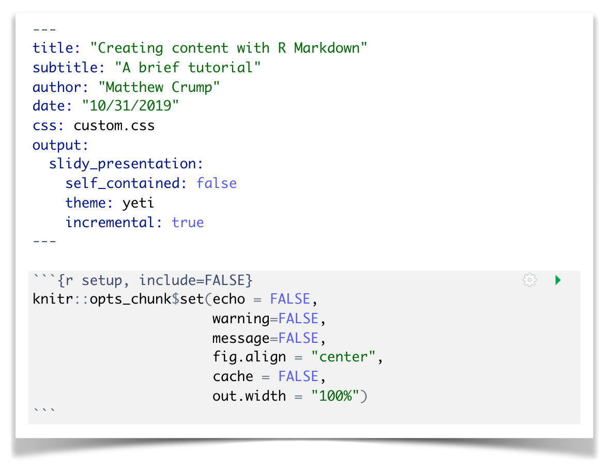
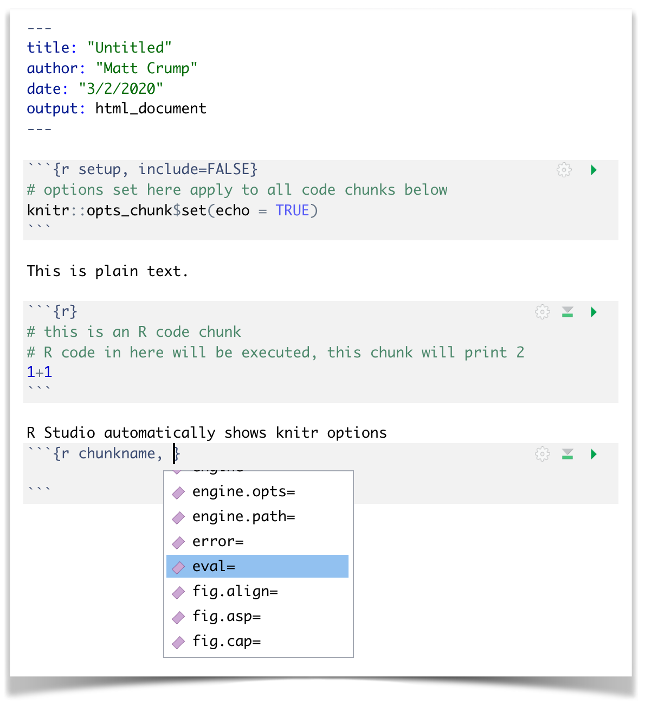
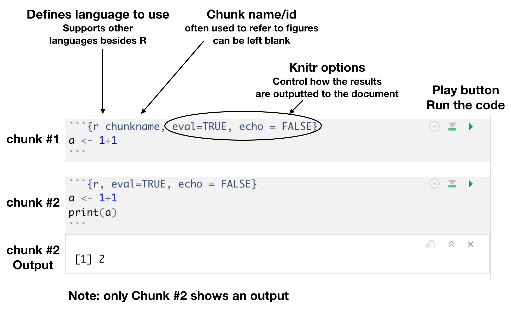
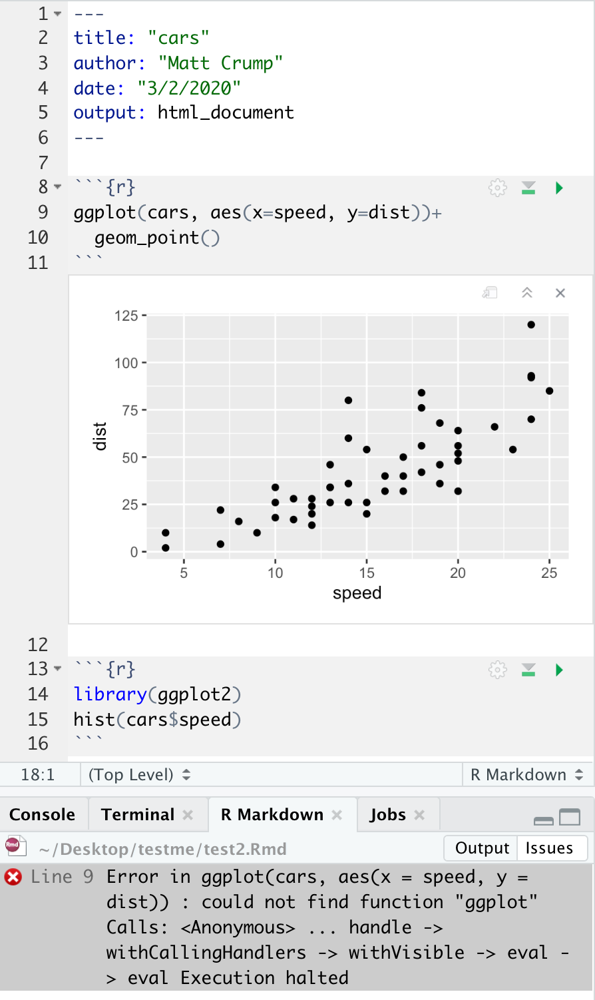
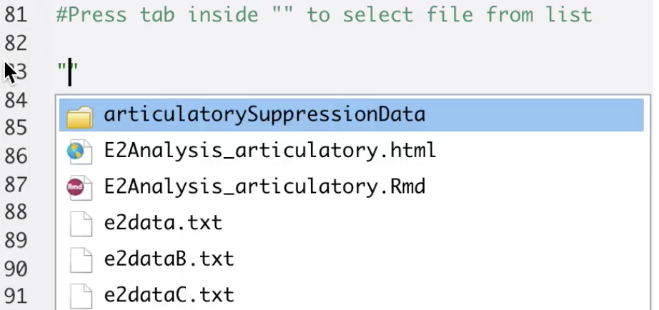

```{r setup, include=FALSE}
knitr::opts_chunk$set(echo = FALSE, 
                      warning=FALSE, 
                      message=FALSE, 
                      fig.align = "center", 
                      cache = FALSE, 
                      out.width = "100%")
```

## What is R Markdown?

Let's take the R Markdown quick tour from RStudio <https://rmarkdown.rstudio.com/authoring_quick_tour.html>

- In brief, R Markdown combines plain text with R code, allowing both to be outputted to a variety of document types, formats and styles (e.g., APA papers, slides, posters, etc.)

## The definitive R Markdown guide

For a comprehensive guide to R Markdown see the definitive guide:

[https://bookdown.org/yihui/rmarkdown/](https://bookdown.org/yihui/rmarkdown/)

- and, a nice guide to basic markdown syntax: <https://www.markdownguide.org/basic-syntax/>

- bells and whistles: <https://holtzy.github.io/Pimp-my-rmd/>

## R Markdown and reproducible science

- R Markdown is a good option for reproducible science. 

- R Markdown documents can contain all of the text for a manuscript, and all of the code used to run analyses and report results, all in one place.

- Thus, if you share your research in R markdown, someone else should be able to reproduce exactly what you did.

## Creating a new R Markdown document from RStudio

<video id="rmarkdown" src="imgs/newRmarkdown.mov" controls></video>

## Example: Reproducible analysis with R Markdown

<div class = "row">
<div class = "col-md-6">


```{r}

```

</div>
<div class = "col-md-6">

Goals: 

1. Create a new R markdown document
2. Load some data
3. Show a figure, and report some descriptive statistics

</div>
</div>


## R Markdown details

1. YAML Front Matter
2. Setup Chunk
3. R code snippets
4. Code snippet knitr options
5. Tips and tricks

## YAML Front matter

<div class = "row">
<div class = "col-md-6">

"YAML Ain't Markup Language"

```{r}

```

</div>
<div class = "col-md-6">

YAML is used to declare global parameters for the document. 

This often includes title, author, bibliography files, and output formats. 

There may be many more parameters depending on the template file used for the R Markdown document.

</div>
</div>

## Setup chunk

<div class = "row">
<div class = "col-md-6">

Set defaults for all R code chunks in setup chunk at the beginning

```{r}

```

</div>
<div class = "col-md-6">

Defaults can be modified for individual chunks later on.

- echo = FALSE, prevents displaying R output
- warning = FALSE, prevents printing of R warnings
- message = FALSE< prevents printing of R messages (e.g., fairly common when loading some packages)
- fig.align = "center", all figures will be center aligned
- cache =  FALSE, turns off caching of results
- out.width = "100%", figure width is 100% of screen

</div>
</div>

## R Code snippets

<div class = "row">
<div class = "col-md-6">

```{r, comment=''}

```

</div>
<div class = "col-md-6">

1. Correctly defined code-chunks appear in a grey-box
2. Option-command-I to automatically create chunk in R Studio (Ctrl-Alt-I on PC)
3. Press play button to run the chunk. Output appears below the chunk in the editor window.

</div>
</div>

## Anatomy of a code chunk

```{r}

```


## Knitr output options

`knitr` is the engine that converts .Rmd files to other file types. Each R code chunk is processed by knitr, and can take on options to control outputs.

- `echo=TRUE` sets the default to print all remaining code blocks to the output, `FALSE` sets the default to not print the code blocks
- `warning = FALSE` turns off printing of warnings
- `message = FALSE` turns off printing of messages, these commonly occur when you load a package, where you receive a message that the package was loaded
- `eval = FALSE` sets the default to **NOT** evaluate the code chunk as R Code. This will not run the code block, but the code block will still print if `echo=TRUE`
- `error=TRUE` normally the knit fails when there is an error in the code. If you set `error=TRUE` the knit will complete, and return an error message for code blocks with errors.

## knitr figure output options

The following setup options are useful for figure output.

- `fig.width = 3` sets the default width in inches for all figures
- `fig.height = 3` sets the default height in inches for all figures
- `fig.path = "myfigs/"` defines folder where figure files will be saved. This will be relative to your current working directoy
- `dev = c("pdf", "png")` tells knitr to output both .png, and .pdf versions of the figure. The .pdf contains vector graphics, meaning the figure can be resized without pixelization.

## Knitting (press knit to compile your document)

<video id="knit" src="imgs/knit.mov" controls></video>

## IMPORTANT KNITTING INFO

1. **Knitting is done in a separate R session behind the scenes**
2. Code snippets are compiled in order from top-to-bottom
3. Knitting can be automated with the `knitr::render()` function, pressing the knit button in RStudio is a built-in way to call the `render` function for the current document.

## Why won't this knit?

<div class = "row">
<div class = "col-md-6">

```{r, comment=''}

```

</div>
<div class = "col-md-6">

Pressing the play button might show the graph, but compiling fails when knitting the document?

1. the call to `ggplot()` occurs in chunk 1 before the package is loaded in chunk 2, causing an error. 
2. The `ggplot2` package may be loaded in the current R session, allowing it to run the first chunk.

</div>
</div>

## Assorted info

- Hit tab inside quotations to search for files in RStudio

```{r, out.width="50%"}

```


- including external graphics
  - `knitr::include_graphics("path/name.ext")`
  
- math equations
  - surround equations with dollar signs
  - e.g., `$\sum$` will be printed as $\sum$
  
- HTML and Latex can be written directly
  - e.g., `<p> paragraph element </p>` will be inserted as a new paragraph element
  - Note: will only work if the hard coded elements are the same as the output type
  
- Latex installation for pdf rendering
  - Rendering pdfs requires a latex installation (full installations can be fairly large ~1 to 2 GB)
  - I'd recommend following `papaja` recommendations here for installing latex <https://crsh.github.io/papaja_man/introduction.html#software-requirements>
  - easy answer is install the `tinytex` package
  - long answer is install a full latex distribution if you are going to be using latex outside of R.

## Multi column

<div class = "row">
<div class = "col-md-6">


</div>
<div class = "col-md-6">


</div>
</div>


- basic idea of rmarkdown
  - Rstudio overview
    -
- make a new rmd
  - working in a project
- knitting


