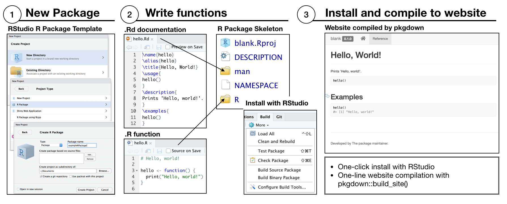
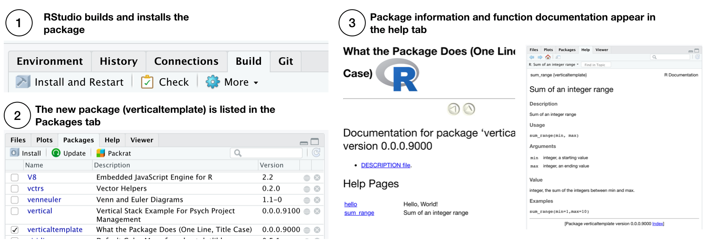
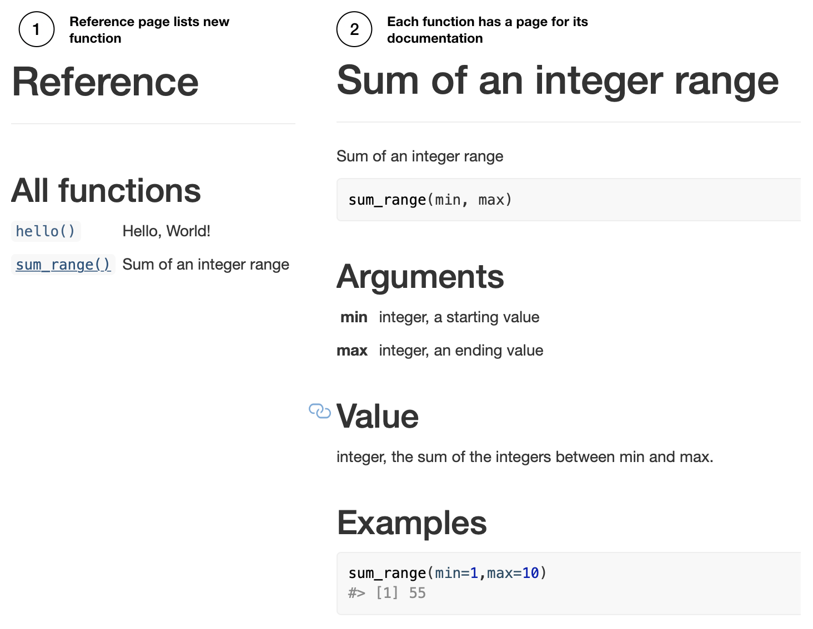

```{r setup, include=FALSE}
knitr::opts_chunk$set(echo = FALSE, warning=FALSE, message=FALSE, fig.align = "center", cache = FALSE, out.width = "100%")
library(nomnoml)
```

## Overview

1. Vertical & R Packages
2. Writing R Packages

## Vertical & R Packages

**vertical** creates a file/folder structure that is an extension of the R package skeleton

R Packages have a specific file/folder organization:

- necessary for making R Packages
- useful as a standard for sharing research assets
- there a lots of helpful R packages that make R package development easier
  - [usethis](https://usethis.r-lib.org), [devtools](https://devtools.r-lib.org), [pkgdown](https://pkgdown.r-lib.org) are installed as dependencies when **vertical** is installed
  
## Hadley Wickham's Guide

For a comprehensive guide to creating R Packages, see Hadley Wickham's free book

[http://r-pkgs.had.co.nz](http://r-pkgs.had.co.nz)

This tutorial covers some basics that are clarified and expanded upon in the above.
  
## R Package skeleton

The template for an R package can be generated by Rstudio when creating a new project.

```{r}

```

Alternatively, the **vertical** template also loads an R Package template

## DESCRIPTION FILE

Provides meta-data about the package, and can declare dependencies (other packages that might be needed to run the functions).

```
Package: verticaltutorial
Title: What the Package Does (One Line, Title Case)
Version: 0.0.0.9000
Authors@R: 
    person(given = "Matthew J. C.",
           family = "Crump",
           role = c("aut", "cre"),
           email = "mcrump@brooklyn.cuny.edu",
           comment = c(ORCID = "0000-0002-5612-0090"))
Description: What the package does (one paragraph).
License: What license it uses
Encoding: UTF-8
LazyData: true

```

## R folder

Place `.r` files that define R functions in the `R` folder.

Use `usethis` to automatically create a new `.r` file, and open it for editing.

```{r, eval=FALSE, echo=TRUE}
usethis::use_r("my_mean")
```

Write your function:

```{r, eval=FALSE, echo=TRUE}
my_mean <- function(x){
   sum(x)/length(x)
}
```

## man folder

The `man` folder is used to save documentation files for your functions.

The "older harder" way was to write `.Rd` files.

The "newer easier" way is to use `roxygen2`, explained next

## Documenting a function

It is important to document functions

- tells other people how they work
- same process can be used to document data!

## Documentation with `roxygen2`

`roxygen2` is an R package (installed by vertical), that makes documentation easier. 

The basic idea is to add `roxygen2` comments to above the function definition in the `.r` file. Then, behind the scenes, these comments are converted into `.Rd` files (so you don't have to write them).

```{r, eval=FALSE, echo=TRUE}
#' My own mean function
#'
#' @param x vector, of numbers
#'
#' @return numeric, the computed mean
#' @export
#'
#' @examples
#' 
#' my_mean(1:10)
my_mean <- function(x){
   sum(x)/length(x)
}
```

## RStudio can insert a `roxygen2` skeleton for you

Make sure your cursor is in an R function:

```{r, eval=FALSE, echo=TRUE}
my_mean <- function(x){
   sum(x)/length(x)
}
```

Then select "Insert Roxygen Skeleton" from the code menu 

```{r, eval=FALSE, echo=TRUE}
#' Title
#'
#' @param x 
#'
#' @return
#' @export
#'
#' @examples
my_mean <- function(x){
   sum(x)/length(x)
}
```

## Compile your documentation

The last step is to generate the .Rd file in the `man` folder, which is used to create the documentation. 

The .Rd file is generated automatically by `devtools::document()`, or by the RStudio macro `Ctrl/Cmd + Shift + D`.
 - click the option under Tools > Project options > Build tools > "Generate documentation with Roxygen"
 
```{r, eval=FALSE, echo=TRUE}
devtools::document()
```

The resulting `.Rd` file looks like this:

```
% Generated by roxygen2: do not edit by hand
% Please edit documentation in R/my_mean.R
\name{my_mean}
\alias{my_mean}
\title{My own mean function}
\usage{
my_mean(x)
}
\arguments{
\item{x}{vector, of numbers}
}
\value{
numeric, the computed mean
}
\description{
My own mean function
}
\examples{

my_mean(1:10)
}
```

## Documenting Data

Data files can be saved in R packages and documented.

1. create a dataframe
2. `usethis::use_data()` adds .rda to `data` folder
3. `usethis::use_r()` adds .R to `R/` for documentation
4. `sinew::makeOxygen` generate roxygen documentation skeleton

```{r, eval=FALSE, echo=TRUE}
# Some data frame
my_data <- data.frame(A=1:10,
                      B=21:30,
                      C=LETTERS[1:10])
```

`usethis` will create the `data` folder, and store a dataframe as an `.rda` file.

```{r, eval=FALSE, echo=TRUE}
usethis::use_data(my_data)
```

To document, we add another `.r` file for the data.

```{r, eval=FALSE, echo=TRUE}
usethis::use_r('data')
```

Next, we will use the `sinew` package to conveniently produce the `roxygen` skeleton for documenting the data.

```{r, eval=FALSE, echo=TRUE}
sinew::makeOxygen(my_data)
```

We copy the following from the console to the `data.R` file.

```
#' @title DATASET_TITLE
#' @description DATASET_DESCRIPTION
#' @format A data frame with 10 rows and 3 variables:
#' \describe{
#'   \item{\code{A}}{integer COLUMN_DESCRIPTION}
#'   \item{\code{B}}{integer COLUMN_DESCRIPTION}
#'   \item{\code{C}}{integer COLUMN_DESCRIPTION} 
#'}
#' @details DETAILS
"my_data"
```

Then modify the skeleton:

```
#' @title my_data
#' @description some sample data
#' @format A data frame with 10 rows and 3 variables:
#' \describe{
#'   \item{\code{A}}{integer some numbers}
#'   \item{\code{B}}{integer some numbers}
#'   \item{\code{C}}{character some letters} 
#'}
#' @details This data was collected...
"my_data"
```

And, recompile the documentation

```{r, eval=FALSE, echo=TRUE}
devtools::document()
```

## Reproducibility considerations

If you are using **vertical** for a psych project, you may raw data. The R package suggestion is to store raw data in the `data-raw` folder.

Data stored in `data-raw` is not included in the R package. The suggestion is to include a pre-processing script in `data-raw` that shows how you import the data into R. Once the data is in R, you can include it in the package using the previous steps.

## NAMESPACE

When we "export" functions, their names are written to the NAMESPACE file. This controls whether the function can be accessed later on when a user installs the package.

```
# Generated by roxygen2: do not edit by hand

export(my_mean)
```
Exporting is controlled in the `roxygen` skeleton:

```{r, eval=FALSE, echo=TRUE}
#' My own mean function
#'
#' @param x vector, of numbers
#'
#' @return numeric, the computed mean
#' @export
#'
#' @examples DELETE THIS LINE TO NOT EXPORT
#' 
#' my_mean(1:10)
my_mean <- function(x){
   sum(x)/length(x)
}
```

## Building an R package

Click "Install and Restart" from the Build tab

```{r}

```

## pkgdown website

R packages can be rendered as websites automatically using `pkgdown::build_site()`. And, we'll explore this more later.

```{r}

```

## Loading a package

After a package is installed it is loaded by the `library()` command:

```{r, echo=TRUE}
library(verticaltutorial)
```

Exported functions will then be available to use:

```{r, echo=TRUE}
my_mean(1:10)
```

And, included datasets are immediately accesible:

```{r, echo=TRUE}
my_data
```

## R Packages and Github

If your R Project containing an R package is shared on Github, then other users can install the package from Github using:

```
devtools::install_github("user/repo")

#if this was on my github
devtools::install_github("CrumpLab/verticaltutorial")
```

## Functions that depend on functions from other packages

You may want to use functions from other packages in your own functions. 

This causes dependency issues, other users need to have those packages installed too.

You can add a dependency to another package from `usethis`, which writes the necessary dependency information to the DESCRIPTION file.

```
usethis::use_package(packagename)
```

Then when you write the function, you can use the `::` syntax to refer the `package::function` in your script.

```
my_function <- function(x){
 package::some_function(x) #calling a function from another package
}
```

## Vignettes

The `vignettes` folder can be used to write R Markdown files to accompany an R package.

These are typically used to provide tutorials for how to use the R package.

You can automatically create a new vignette with `usethis`:

```
usethis::use_vignette('filename')
```

We discuss R Markdown in the next module.


## Multi column

<div class = "row">
<div class = "col-md-6">


</div>
<div class = "col-md-6">


</div>
</div>


