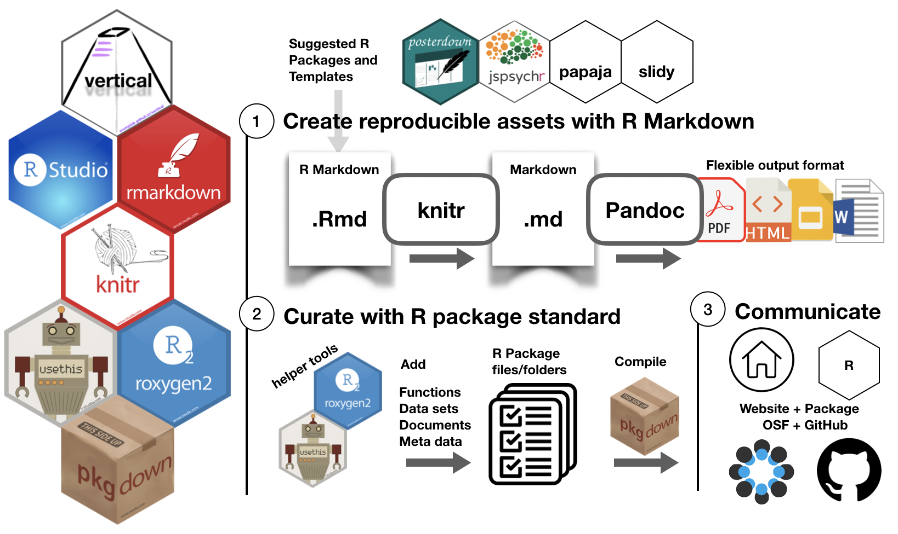

```{r setup, include=FALSE}
knitr::opts_chunk$set(echo = FALSE, warning=FALSE, message=FALSE, fig.align = "center", cache = FALSE, out.width = "100%")
library(nomnoml)
```

## Overview

- Motivation: a few reasons to adopt a reproducible workflow
- Explanation: reproducible workflows in R with vertical

## Motivation: Validating your assertions

In science we do things and communicate what we did.

```{r, out.width="80%"}

```

How do we know **what you did**  *is equal to* **what you said you did**?

- verification is possible with reproducible research workflows

## Motivation: Save your future self from your past self

<div class = "row">
<div class = "col-md-6">

Your file system and organization strategy?

```{r}
knitr::include_graphics("imgs/naked_gun.gif")
```

</div>
<div class = "col-md-6">

Researchers often create their own workflows:

- some are organized
- some are not
- If your future self can't figure out what your past self did...
  - you might benefit from a reproducible workflow

</div>
</div>

## Motivation: Your hands are a problem child

<div class = "row">
<div class = "col-md-6">

Your file system and organization strategy?

```{r}
knitr::include_graphics("imgs/problem_child.gif")
```

</div>
<div class = "col-md-6">

- Human error is normal, common, and inescapable
- Doing things by hand often inserts error:
  - pre-processing data
  - reporting results
- Reproducible workflows can make errors **identifiable**

</div>
</div>

## Motivation: Learn new, useful, and generalizable skills

- Reproducible research skills can benefit your research
 - automate analyses and reporting
 - computational skills build on each other
 - widely applicable inside and outside academia

## Vertical Overview

```{r, out.width="80%"}

```

## Vertical Structure

```{r, out.width="80%"}
knitr::include_graphics("imgs/vertical/vertical-structure.png")
```

## Vertical Website

```{r, out.width="80%"}
knitr::include_graphics("imgs/vertical/vertical-website.png")
```

## Install & Usage {.slim10}

Install from Github (need devtools):

```{r, echo=TRUE, eval=FALSE}
#install.packages('devtools')
devtools::install_github("CrumpLab/vertical")
```

Initialize new project:

```{r, echo=TRUE, eval=FALSE}
vertical::vertical_project()
```

Build the project website:

```{r, echo=TRUE, eval=FALSE}
vertical::build_vertical()
```


## Multi column

<div class = "row">
<div class = "col-md-6">


</div>
<div class = "col-md-6">


</div>
</div>


